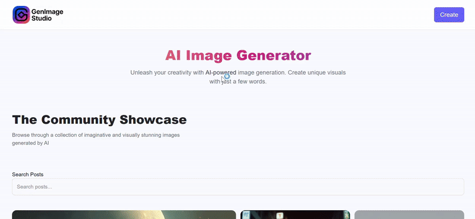
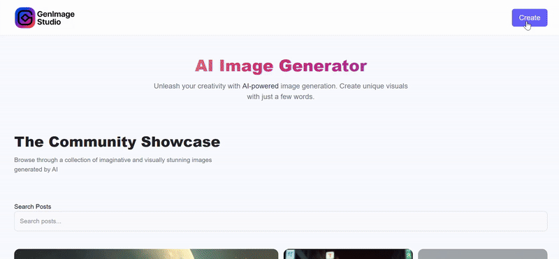

GenImage-Studio 🎨

An AI-based image generation web app that lets users create images from text prompts using the ClipDrop API.
Built with the MERN stack and Vite + React for a modern, lightning-fast development experience.

🚀 Features

✨ Generate high-quality AI images from text prompts.

🎨 Community Showcase – explore and like AI-generated images shared by others.

📱 Frontend built with Vite + React + Tailwind CSS (super fast dev server, instant HMR).

⚡ Backend APIs built with Express + Node.js.

🗄️ MongoDB for storing user prompts, generated images, and metadata.

☁️ Integrated with Cloudinary for fast and efficient image hosting.

🌍 Deployed on Render for global access.

Demo:

creating new image:

🛠️ Tech Stack

Frontend: Vite + React, Tailwind CSS
Backend: Node.js, Express
Database: MongoDB
Image Hosting: Cloudinary
AI API: ClipDrop API
Deployment: Render

⚡ Getting Started
1️⃣ Clone the repo
git clone https://github.com/your-username/GenImage-Studio.git
cd GenImage-Studio

2️⃣ Install dependencies
npm install

3️⃣ Setup environment variables

*Create a .env file in the root folder with:*

MONGO_URI=your_mongodb_connection_string

CLOUDINARY_CLOUD_NAME=your_cloud_name

CLOUDINARY_API_KEY=your_api_key

CLOUDINARY_API_SECRET=your_api_secret

CLIPDROP_API_KEY=your_clipdrop_api_key

4️⃣ Run the app (Vite Dev Server 🚀)
npm run dev

Open your browser at the URL shown (usually http://localhost:5173).

🌐 Deployment

The app is deployed on Render.
Frontend + Backend + Database + Cloudinary are all integrated for smooth performance.

🙌 Acknowledgements

ClipDrop API
 for AI image generation.

Cloudinary
 for image hosting.

Render
 for deployment.

Vite
 for the fast frontend dev experience.
